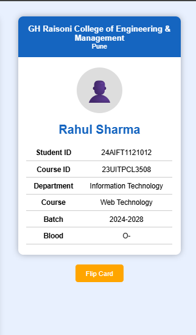

# 🎓 Web Technology ID Card Generator

A simple and interactive **Web Technology ID Card Generator** developed using **HTML, CSS, and JavaScript**. This project allows users to enter student details, validates the input using JavaScript, and dynamically generates a professional-looking Web Technology ID card with a 3D flip animation.

---

## 📌 Features

- 📝 Student Details Form
- 🆔 Dynamic Student ID Card Generation
- 🔄 3D Flip Card Animation
- ✅ JavaScript Form Validation
- 📱 Responsive Design
- 🔄 Reset Functionality
- 📧 College Email Validation
- 📞 Phone Number Validation
- 🏷️ Student ID & Course ID Validation
- 📊 Barcode Display
- 🎨 Clean and User-Friendly Interface

---

## 🛠️ Technologies Used

- HTML5
- CSS3
- JavaScript (ES6)

---

# 📂 Project Structure

```text
AWt-A-14/
│
├── images/
│   ├── form.png
│   ├── front-card.png
│   └── back-card.png
│
├── index.html
├── style.css
├── script.js
└── README.md
```

---

# 📸 Project Screenshots

## Student Details Form

<p align="center">
    
</p>

---

## Generated ID Card

<p align="center">
    
    
</p>

---

# 📋 Input Fields

The application collects the following student information:

- Student Name
- Student Registration ID
- Course ID
- Department
- Course
- Batch
- Blood Group
- College Email
- Phone Number

---

# ✅ Input Validations

### Student Name

- Required
- Minimum 3 characters
- Only alphabets and spaces allowed

**Example**

```
Rahul Sharma
```

---

### Student ID

**Format**

```
24AIFT0000001
```

**Validation**

- Starts with 2 digits
- Followed by **AIFT**
- Ends with 7 digits

---

### Course ID

**Format**

```
23UITPCL3508
```

**Validation**

- Starts with 2 digits
- Followed by 6 uppercase letters
- Ends with 4 digits

---

### Department

- Required
- Selected from the dropdown list

---

### Course

- Cannot be empty

---

### Batch

**Format**

```
2024-2028
```

---

### Blood Group

Available options:

- A+
- A-
- B+
- B-
- AB+
- AB-
- O+
- O-

---

### College Email

Only college email addresses ending with the following domain are accepted:

```
@ghrcemp.raisoni.net
```

**Example**

```
student@ghrcemp.raisoni.net
```

---

### Phone Number

- Must contain exactly 10 digits

**Example**

```
9876543210
```

---

# 🚀 How to Run the Project

### 1. Clone the Repository

```bash
git clone https://github.com/akhilesh-dct/AWT-A-14.git
```

### 2. Open the Project Folder

```bash
cd AWT-A-14
```

### 3. Open the Project

Open **index.html** in any modern web browser.

### 4. Generate an ID Card

- Fill in all required details.
- Click **Generate ID Card**.
- Click **Flip Card** to view the back side.
- Click **Reset** to clear the form.

---

# 🔄 Application Workflow

```text
Fill Student Details
        │
        ▼
Click Generate ID Card
        │
        ▼
JavaScript Validates Inputs
        │
        ▼
Generate Student ID Card
        │
        ▼
Click Flip Card
        │
        ▼
View Back Side
```

---

# 📚 Concepts Used

### HTML

- Forms
- Input Fields
- Select Elements
- Buttons
- Tables
- Div Elements

### CSS

- Flexbox
- Responsive Design
- Card Styling
- Hover Effects
- 3D Transform
- CSS Transitions

### JavaScript

- DOM Manipulation
- Event Handling
- Form Validation
- Regular Expressions (Regex)
- Dynamic Content Generation
- Reset Functionality

---

# 🎯 Learning Outcomes

This project helps in understanding:

- HTML Form Design
- CSS Styling Techniques
- Responsive Web Design
- JavaScript DOM Manipulation
- Form Validation using Regex
- Event Handling
- CSS 3D Flip Animation
- Dynamic Web Page Development

---

# 🔮 Future Enhancements

- 📥 Download ID Card as PNG
- 🖨️ Print ID Card
- 📷 Profile Photo Upload
- 📱 QR Code Generation
- 🌙 Dark Mode
- 💾 Database Integration
- 🏫 Multiple ID Card Templates

---

# 👨‍💻 Author

**Name:** Akhilesh Dhumal

**Course:** B.Tech – Information Technology

**College:** G H Raisoni College of Engineering & Management, Pune

---

# 📜 License

This project is developed for **educational purposes** as part of the **Web Technology Practical Assignment**.

---

# ⭐ Acknowledgement

If you found this project helpful, consider giving it a **⭐ Star** on GitHub.

Happy Coding! 🚀